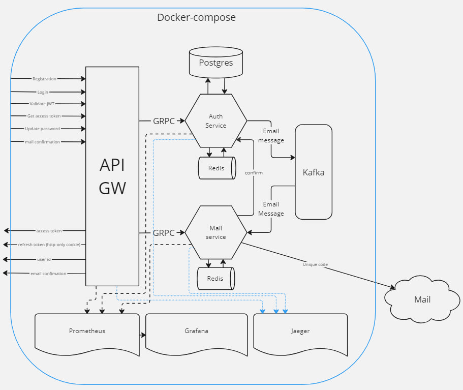

<div>
    
</div> 


# Название проекта

## Описание
Этот проект представляет собой систему микросервисов для аутентификации и верификации пользователей. Включает функционал регистрации, входа в систему и обновления пароля. Процесс регистрации использует паттерн **Transactional Outbox**, чтобы обеспечить атомарность операции с отправкой верификационного письма.


- **API Gateway**: Обрабатывает REST запросы и предоставляет Swagger UI для документации.
- **Сервис аутентификации**: Обрабатывает аутентификацию пользователей и управление данными.
- **Сервис почты**: Отправляет верификационные письма и управляет почтовыми операциями.
- **Мониторинг**: Используются Jaeger, Grafana и Prometheus для мониторинга и трассировки.

## Сервисы и конечные точки

### API Gateway
- **Swagger UI**: [http://localhost:8080/swagger/](http://localhost:8080/swagger/)
- API Gateway служит точкой входа для всех REST запросов.

### Сервис аутентификации
- **URL сервиса**: [http://localhost:50051](http://localhost:50051)
- Отвечает за аутентификацию пользователей и управление данными о пользователях.

### Сервис почты
- **URL сервиса**: [http://localhost:50052](http://localhost:50052)
- Отправляет верификационные письма и принимает запрос о проверке уникального кода.

## Мониторинг и метрики

- **Jaeger UI (Трассировка)**: [http://localhost:16686](http://localhost:16686)
- **Grafana UI (Метрики)**: [http://localhost:3000/login](http://localhost:3000/login)
- **Prometheus UI (Метрики)**: [http://localhost:9090/](http://localhost:9090/)

## Функционал

### 1. Регистрация
- **Описание**: Позволяет пользователям зарегистрироваться, указав email, пароль, имя, фамилию и роль.
- **Transactional Outbox**: При регистрации данные пользователя сохраняются в таблице outbox с использованием паттерна transactional outbox, что обеспечивает атомарность между процессом регистрации и отправкой верификационного письма.
- **Верификация**: После регистрации пользователю отправляется письмо для активации аккаунта.

### 2. Логин
- **Описание**: Позволяет пользователям войти в систему, проверяя их данные (email и пароль) в базе данных.

### 3. Обновление пароля
- **Описание**: Позволяет пользователю обновить пароль, связанный с его email.

## Безопасность

Весь функционал сопровождается механизмом **JSON Web Token (JWT)**, который обеспечивает безопасную работу с данными пользователя.

- На уровне **API Gateway** реализована работа с хедерами, настройка **refresh токенов** в **http-only cookie**, а также реализована **Swagger документация** для комфортной работы с API.
- На уровне **Auth Service** реализованы механизмы **генерации** и **валидации JSON Web Token**. Также, на этом уровне внедрены паттерны отказоустойчивости, такие как **circuit breaker** и **rate limiter**.
- На уровне **Mail service** реализован механизм генерации и проверки уникального кода и хранение его с заданным TTL.

## Архитектура 

Каждый микросервис реализован на базе **чистой архитектуры** и использует **свой DI контейнер** для удобной работы с зависимостями.


## Настройка и тестирование
В Makefile в каждом проекте собраны основные команды для генерации/тестирования/линтера и других полезных команд.

### Требования
- Docker
- Docker Compose

### Запуск проекта

1. Клонируйте репозиторий:

    ```bash
    git clone https://github.com/AwesomeXjs/registration-service-with-checking-mail.git
    ```

2. Постройте и запустите сервисы с помощью Docker Compose:

    ```bash
    docker-compose up --build
    ```
   Или
   ```bash
    make compose
    ```

